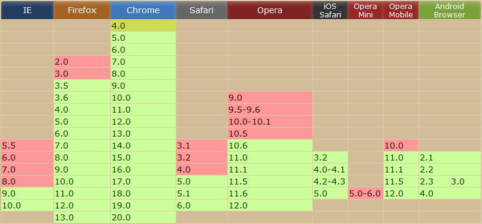

La terre est ronde !

...et non pas plate...C&#039;est une révolution !

Voir démo 3_bis (chapitre 4)

**2012 ©** **Mobile****-tuts ! Actualités et tutoriels autour des technologies mobiles**75

**Développer avec jQuery Mobile – Première Édition**

5.2 . Balises HTML 5 spéciales

5.2.1 Insérer du contenu multimédia : les balises audio et video

La sortie de HTML5 a été l&#039;occasion d&#039;introduire de nouvelles balises. Longtemps gérés par des plugins et autres outils comme Flash ou Silverlight, les lecteurs audio et vidéo sont désormais disponible en HTML. Comparé à Flash, la déclaration d&#039;une vidéo ou d&#039;un fichier audio en HTML 5 peut se faire en 2 lignes. La plupart du temps on rajoute un peu plus de lignes que ça, mais cela est optionnel.

<video>width=&quot;320&quot;height=&quot;240&quot;controls=&quot;controls&quot;&gt;</video>

src=&quot;http://www.w3schools.com/html5/movie.ogg&quot;

type=&quot;video/ogg&quot;/&gt;

src=&quot;http://fa.cotecine.fr/pod/7601%20vf%20fa3.mp4&quot;

type=&quot;video/mp4&quot;/&gt;

Votre mobile semble ne pas être compatible le format video

html5.

Voir la démo 4 (chapitre 5)

5.2.2 Interagir avec son téléphone: les attributs email et tel

Avec HTML5 il est désormais possible d’interagir plus ou moins facilement avec son appareil mobile. De nouveaux attributs comme **email** et **tel** ont ainsi été ajoutés aux champs de saisies :

type=&quot;email&quot;value=&quot;charles@charlesen.fr&quot; /&gt; type=&quot;tel&quot;value=&quot;+336xxxxxxxx&quot; /&gt;

(Les croix sont bien sûr à remplacer par des chiffres)

**2012 ©** **Mobile****-tuts ! Actualités et tutoriels autour des technologies mobiles**76

**Développer avec jQuery Mobile – Première Édition**

Ces deux input, plus sémantiques, permettent au téléphone d&#039;adapter son clavier à la saisie en cours. Ainsi, un utilisateur qui serait en train de saisir son adresse mail dans le champs de saisie email verra son clavier mettre plus avant des mots ou

caractères comme l&#039;arobase, le &#039;**.**&#039; ou encore les extensions de domaines (.com, .fr).

Par ailleurs, ces même attributs existent aussi pour les liens hypertextes. Si le mail en lien hypertexte existe depuis longtemps, la possibilité d&#039;écrire son numéro de téléphone dans un lien hypertexte est beaucoup plus récente.

Un clic sur le lien déclenchera, depuis un téléphone mobile, un appel vers le numéro indiqué

href=&quot;tel :+336xxxxxxxx&quot; /&gt;

5.2.3 Autres attribut HTML 5 : search, url

Ces attributs contribuent eux aussi à améliorer l&#039;expérience utilisateur. Ils sont particulièrement utiles dans un contexte de mobilité car en mettant en déclenchant la mise en avant de certaines touches du clavier, ils améliorent considérablement la saisie de données.

Exemple : les attributs search et url facilitent eux aussi la saisie au clavier.

type=&quot;search&quot;value=&quot;&quot; /&gt; type=&quot;url&quot;value=&quot;charlesen.fr&quot; /&gt;

**2012 ©** **Mobile****-tuts ! Actualités et tutoriels autour des technologies mobiles**77

**Développer avec jQuery Mobile – Première Édition**

5.3 . Persistance de données

5.3.1 Stockage dans la session

HTML5 met à disposition la fonction sessionStorage, qui permet de stocker des données pour le temps d&#039;un succès.

sessionStorage est un objet de type storage qui représente un espace de stockage défini comme attribut de chaque fenêtre. Il est créé pour un nouveau visiteur et supprimé quand l&#039;utilisateur se déconnecte, ou à la demande d&#039;un script.

Il est implémenté dans les navigateurs depuis Firefox 3, Internet Explorer 8 et sur

Chrome, Safari. Le stockage se fait simplement :

// La sauvegarde en Session

sessionStorage.login = &quot;utilisateur&quot;;

// Récupérer en Session

var login = sessionStorage.login

5.3.2 Stockage permanent côté client

Avec la venue du HTML5, une nouvelle méthode de stockage des données est introduite: Le stockage local (localStorage).C&#039;est sans doute l&#039;une des prorpiétés les plus intéressantes du HTML5: Le local storage, ou le stockage local.

En effet, grâce à cette propriété, il sera désormais possible de stocker des données localement dans votre navigateur (supportant la propriété bien sûr).

**2012 ©** **Mobile****-tuts ! Actualités et tutoriels autour des technologies mobiles**78

**Développer avec jQuery Mobile – Première Édition**

Les données sont stockées pour un domaine précis et peuvent récupérées dans n&#039;importe quelle page du domaine en question. La propriété s&#039;annonce comme le remplacement des cookies à la différence qu&#039;il est possible de stocker bien plus d&#039;informations (Environ 5 Mb) et que seul le client peut accéder à ces données.

**Stocker** une valeur en local se fait de deux façons différentes :

*   **localeStorage**[&#039;une_cle&#039;] =&#039;une_valeur&#039;;

*   **localeStorage.setitem**(&#039;ma_cle&#039;, &#039;une_valeur&#039;);

**Récupérer** des valeurs se fait presque aussi simplement que le stockage :

*   **localeStorage**[&#039;une_cle&#039;]

*   **localeStorage.getitem**[&#039;ma_cle&#039;];

Supprimer un élément :

*   **removeItem**(&#039;ma_cle&#039;)

**2012 ©** **Mobile****-tuts ! Actualités et tutoriels autour des technologies mobiles**79

**Développer avec jQuery Mobile – Première Édition**

5.4 . Utilisation de la Géolocalisation

5.4.1 Connaître ses coordonnées géographiques

La géolocalisation est un point de plus en plus pris en compte dans le développement d&#039;applications mobiles. Avec HTML5 il est assez facile de récupérer les coordonnées géographiques, un plus à ajouter à nos applications jQuery Mobile. La géolocalisation, souvent critiquée dans ses débuts, est désormais présent dans de nombreux navigateurs. On peut donc l&#039;utiliser à priori sans craindre de mauvaises surprises. Le tableau ci-dessous nous présente sa prise en charge par différents navigateurs (desktop et mobile) :

Nous allons voir comment il est possible de récupérer les coordonnées d’un utilisateur et comment gérer les cas de succès et d’erreur lors du démarrage du processus de géolocalisation grâce à des fonctions appellées callbacks.

**2012 ©** **Mobile****-tuts ! Actualités et tutoriels autour des technologies mobiles**80

**Développer avec jQuery Mobile – Première Édition**

Nous verrons aussi comment suivre ses déplacements, connaître sa vitesse et même sa direction.

La première chose à faire est de tester la prise en charge de la géolocalisation par le device client (ordinateur, smartphone, tablette, …). Il suffit de faire un simple test conditionnel :

// Vérifie la prise en charge de la géolocalisation par le navigateur courant

**if** (navigator.geolocation) { … }

le navigator.geolocation renvoi vrai si le navigateur prend en charge la géolocalisation, et faux sinon.

Si ce test est positif, nous pourrons donc, après validation de l&#039;utilisateur d&#039;être géolocalisé, afficher tranquillement nos coordonnées géographiques. C&#039;est ce que nous précisons dans le code ci-dessous :

**Illegal HTML tag removed :**

**if** (navigator.geolocation) {

**var** watchId =

navigator.geolocation.watchPosition(successCallback, errorCallback,

{enableHighAccuracy:**true**});

}

**else** {

alert(&quot;Votre navigateur ne prend pas en compte la  géolocalisation HTML5&quot;);

}

Le paramètre **enableHighAccuracy** permet d&#039;activer le GPS

**2012 ©** **Mobile****-tuts ! Actualités et tutoriels autour des technologies mobiles**81

**Développer avec jQuery Mobile – Première Édition**

**successCallback** et **errorCallback** sont appelées fonctions de Callback etpermettent de gérer les cas de succès et d&#039;échec du processus de géolocalisation. Trois types d’échecs sont possible :

*   Permission refusée par l&#039;utilisateur

*   Indétermination de la position de l&#039;utilisateur

*   Timeout dans l&#039;exécution de la requête

Nous définissons ensuite les fonctions de Callback :

**function** successCallback(position){

$(&#039;div[data-role=&quot;content&quot;]&#039;).after(&#039;

Latitude : &#039; + position.coords.latitude + &#039;

&#039; + &#039;

Longitude :&#039; + position.coords.longitude + &#039;

&#039;);

};

**function** errorCallback(error){

**switch**(error.code){

**case** error.PERMISSION_DENIED:

alert(&quot;L&#039;utilisateur n&#039;a pas autorisé l&#039;accès à sa

position&quot;);

break;

**case** error.POSITION_UNAVAILABLE:

alert(&quot;L&#039;emplacement de l&#039;utilisateur n&#039;a pas pu

être déterminé&quot;);

break;

**case** error.TIMEOUT:

alert(&quot;Le service n&#039;a pas répondu à temps&quot;); break;

}

};

Voir démo 6 (chapitre 5)

**2012 ©** **Mobile****-tuts ! Actualités et tutoriels autour des technologies mobiles**82

**Développer avec jQuery Mobile – Première Édition**

5.4.2 Afficher une fenêtre Google Maps

Reprenons notre exemple précédent. On souhaite afficher une Google Maps en fonction de sa position géographique. Google fournit une API permanent de récupérer un lien vers une carte dont on aura renseigner les coordonnées géographiques.

Voir démo 6 bis (chapitre 5)

6 . Développer avec le Framework PhoneGap

6.1 . jQuery Mobile et PhoneGap

PhoneGap est un framework de développement d&#039;applications natives en Javascript, CSS et HTML. Elle a la particularité de pouvoir exploiter les fonctionnalités et les ressources du mobile sur lequel elle se lance (géolocalisation, accéléromètre, etc.).. Les applications sont construites comme de simples pages HTML avant d&#039;être packagées pour s&#039;exécuter dans un UIWebView (iOS) ou une WebView (Android).

6.2 . Développer avec PhoneGap

6.2.1 Pré-requis

Suivant que l&#039;on souhaite développer pour l&#039;un ou l&#039;autre des OS mobiles existants, il faut respecter plusieurs conditions :

**2012 ©** **Mobile****-tuts ! Actualités et tutoriels autour des technologies mobiles**83

**Développer avec jQuery Mobile – Première Édition**

*   Pour développer avec **iOS**, il faut :

*   *   MAC OS X Snow Leopard

*   *   La certification iOS développeur (pour publier votre app)

*   *   Xcode

*   *   Le SDK (kit de développement) de PhoneGap

*   Pour développer sous **Android**, il faut :

*   *   Eclipse 3.4+

*   *   Le SDK Android

*   *   Le plugin ADT pour Eclipse (Outils de developpement Android)

*   *   Le SDK de PhoneGap

*   Pour développer pour **Windows Phone**, il faut :

*   *   Windows 7 ou Vista SP2

*   *   Le SDK des Windows Phone

*   *   Le SDK de PhoneGap

6.2.2 Installation de PhoneGap

Une explication détaillée pour chaque plate-forme est disponible à cette adresse :

http://phonegap.com/start

6.2.3 Importer son projet jQuery Mobile

Le développement PhoneGap se fait en html, JavaScript et css. Les fichiers nécessaires au développement son stockés dans le dossier www. C&#039;est dans ce dossier qu&#039;il faudra importer les fichiers jQuery Mobile.

**2012 ©** **Mobile****-tuts ! Actualités et tutoriels autour des technologies mobiles**84

**Développer avec jQuery Mobile – Première Édition**

Annexes :

Émulateurs mobiles

*   **iPhone Tester :** http://iphonetester.com

*   Vous trouverez une liste plus complète à cette adresse : http://www.mobilexweb.com/emulators

Sites et blogs

*   **Site et documentation officiel de jQuery Mobile :** http://jquerymobile.com

*   **Documentation officiel de jQuery :** http://api.jquery.com

*   **Mobile-tuts! :** site d&#039;actualités et de tutoriels autour des technologiesmobiles

*   **Sélecteurs jQuery :** Une liste complète de sélecteurs jQuery est disponible à

l&#039;adresse : http://jquery.developpeurweb2.com/documentation/selecteurs.php

*   **Fonctions de manipulation du DOM** : Une liste complète de fonctions demanipulation du DOM est disponible à l&#039;adresse : http://jquery.developpeur-web2.com/documentation/manipulation.php

*   **jQM Offline :** http://www.raymondcamden.com/index.cfm/2011/3/12/Building-an-offline-capable-mobile-web-site-with-jQuery-Mobile

*   **jQM Developement tips:** http://www.jquery4u.com/mobile/50-jquery-mobile-development/

*   **jQuery Mobile Running** :http://www.amazon.com/jQuery-Mobile-Running-Maximiliano-Firtman/dp/1449397654

**2012 ©** **Mobile****-tuts ! Actualités et tutoriels autour des technologies mobiles**85

**Développer avec jQuery Mobile – Première Édition**

Références

*   **International Telecommunication Union (ITU)**._The World in 2011 – ICT Facts and__Figures_, Novembre 2011 :http://www.itu.int/ITU-D/ict/facts/2011/material/ICTFactsFigures2011.pdf

*   J. Chaffer &amp; K. Swedberg. **_JQuery : Simplifiez et enrichissez vos développements JavaScript_**_,_

du titre original **Learning jQuery 1.3**. Traduit de l&#039;américain par Hervé Soulard. ISBN original : 978-1-847196-70-5\. ISBN de la traduction : 978-2-7440-2381-1

**2012 ©** **Mobile****-tuts ! Actualités et tutoriels autour des technologies mobiles**86