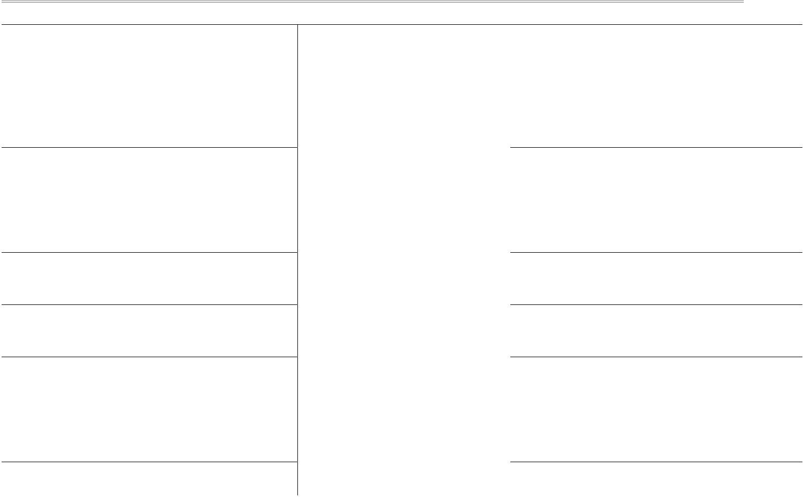
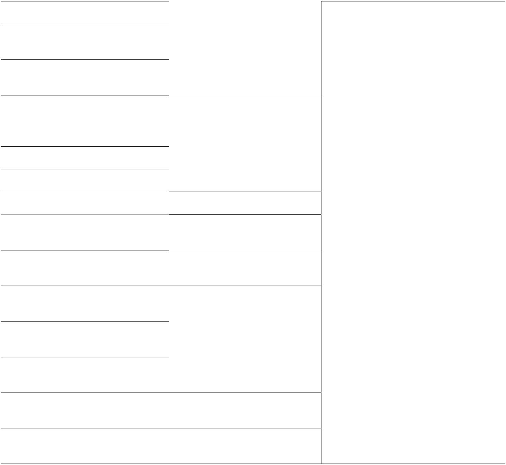
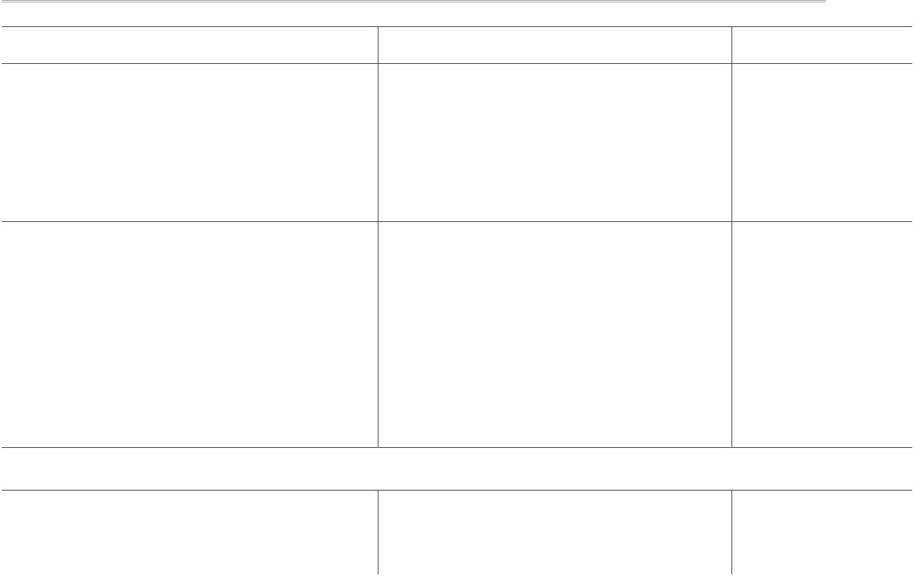
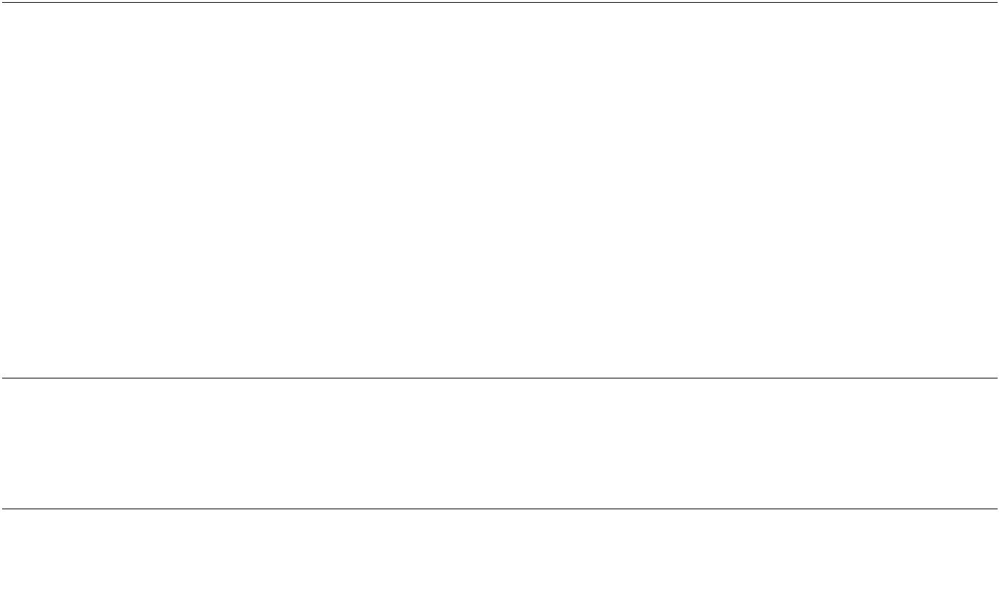
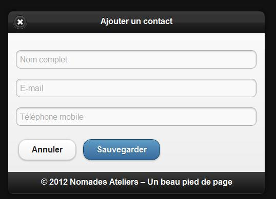
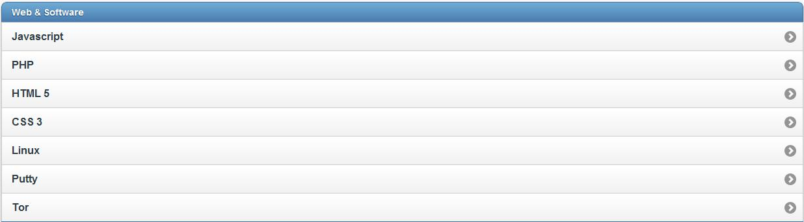
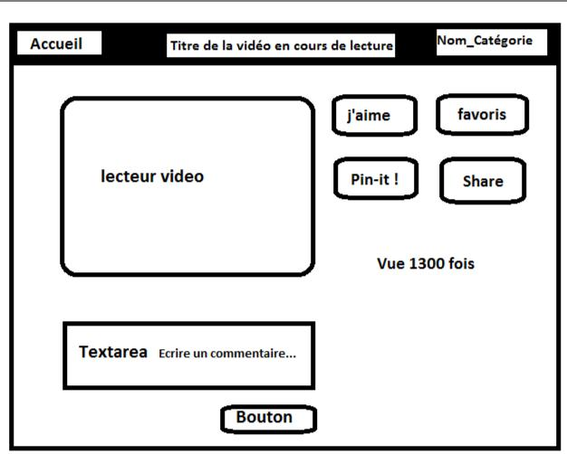
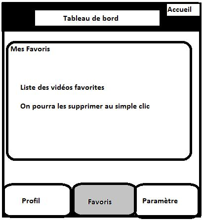
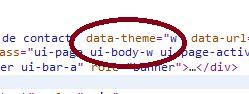

# Éditer {#diter}

un contact

href=&quot;index.html&quot;data-icon=&quot;check&quot;data-theme=&quot;b&quot;&gt;Sauvegarder

*   La barre de pied de page :qui est généralement le dernier élément d&#039;une

page et se construit exactement comme une barre d&#039;outil d&#039;entete :

data-role=&quot;footer&quot;class= &#039;&#039;ui-bar&#039;&#039;&gt;

href=&quot;index.html&quot; data-role=&quot;button&quot; data-icon=&quot;delete&quot;&gt;Supprimer href=&quot;index.html&quot; data-role=&quot;button&quot; data-icon=&quot;plus&quot;&gt;Ajouter

**2012 ©** **Mobile****-tuts ! Actualités et tutoriels autour des technologies mobiles**46

**Développer avec jQuery Mobile – Première Édition**

href=&quot;index.html&quot; data-role=&quot;button&quot; data-icon=&quot;arrow-u&quot;&gt;Haut href=&quot;index.html&quot; data-role=&quot;button&quot; data-icon=&quot;arrow-d&quot;&gt;Bas

Voir la démo 9 (chapitre 3).

3.5.2 Barres d&#039;outils de type fixe

Il est possible de rendre fixe une barre d &#039;outil en rajouter simplement l&#039;attribut data-position=&quot;fixed&quot;.

3.5.3 Utiliser les barres de navigation

jQuery dispose d&#039;un widget qui gère la navigation par onglet, qui se définit là aussi très facilement

*   Un*   Deux

On peut choisir d&#039;insérer la navigation par onglet dans notre pied de page :

data-role=&quot;footer&quot;&gt;

data-role=&quot;navbar&quot;&gt;

*   href=&quot;#&quot;&gt;Un

*   href=&quot;#&quot;&gt;Deux

*   href=&quot;#&quot;&gt;Trois

**2012 ©** **Mobile****-tuts ! Actualités et tutoriels autour des technologies mobiles**47

**Développer avec jQuery Mobile – Première Édition**

3.6 . Travaux pratiques

*   Premiers pas avec jQuery Mobile

*   *   Installer un environnement de travail : importation des librairies javascript, documents CSS, ... Faire valider votre installation.

*   Création de pages

*   *   Créer une vue comportant un titre, un contenu et un pied de page

*   *   Ajouter quatre vues différentes à votre application, de façon à ce que l&#039;on puisse naviguer de la page 1 (#page1) vers la page 2(#page2), de la page 2 vers la page 3(#page3), de la page 3 vers page 4(#page4) et de la page 4 vers la page 1.

*   *   *   page 1 ↔ page 2 ↔ page 3 ↔ page 4

*   *   Remplacer l&#039;ID de la page 2 par **&#039;&#039;#page22&#039;&#039;**. Ne changer rien d&#039;autre. Depuis la page 1 cliquez sur le lien menant à la page 2\. Que se passe t-il ?

*   Embellir son application

*   *   Définir des icônes pour différents formats d&#039;application.

*   *   Ajouter un splashpage (iOS) à votre application.

*   Utiliser des formulaires

*   *   Créer une page de connexion : Login, mot de passe. Le formulaire aura un id=&#039;&#039;formulaire&#039;&#039;.

*   *   Valider le formulaire en ajoutant le script jQuery suivant juste avant la balise :

**2012 ©** **Mobile****-tuts ! Actualités et tutoriels autour des technologies mobiles**48

**Développer avec jQuery Mobile – Première Édition**

**Illegal HTML tag removed :**

$(&quot;#formulaire&quot;).submit( function() {

if ( $(&quot;input&quot;, this).val().length &gt; 0 ) {

$(&#039;#formulaire&#039;).after(&#039;

Erreur

&#039;).css(&#039;background&#039;,&#039;red&#039;);

return false ;// Le formulaire n&#039;est pas envoyé.

}

} ); 

**Illegal HTML tag removed :** src=&quot;mon-script-perso.js&quot;&gt;

**Illegal HTML tag removed :** src=&quot;jquery-mobile.js&quot;&gt;

**2012 ©** **Mobile****-tuts ! Actualités et tutoriels autour des technologies mobiles**51

**Développer avec jQuery Mobile – Première Édition**

Et c&#039;est dans le fichier **&quot;mon-script-perso.js&quot;** que l&#039;on écrira l&#039;enregistrement JavaScript de l&#039;événement.

A partir de là, on pourra personnaliser notre environnement d&#039;exécution en ajoutant nos propres paramètres par défaut.

4.1.2 Options de configuration

Comme on l&#039;a précisé plus haut, les options de configuration sont à préciser lors de l&#039;enregistrement de l&#039;événement **_mobileinit ._** L&#039;assignation d&#039;une option se fait à l&#039;aide de l&#039;objet $.mobile :

**$(document)**.**bind**(&quot;mobileinit&quot;,**function**(){

**$.mobile**.une_option = valeur;

});

**_une_option_ **: l&#039;option que l&#039;on souhaite modifier. Ces options sont proposées par le****framework (Voir tableau plus bas)

**_valeur_ **:****ce que l&#039;on souhaite ajouter à l&#039;option

Supposons que l&#039;on souhaite désactiver Ajax. jQuery Mobile met à disposition l&#039;attribut **ajaxEnabled.** Il suffit donc, pour le désactiver, de faire:

**$(document)**.**bind**(&quot;mobileinit&quot;,**function**(){

**$.mobile**.ajaxEnabled = false;//Désactive Ajax dans l&#039;application

});

Il existe plusieurs options de configuration. Nous en listons quelques unes dans ce tableau :

**2012 ©** **Mobile****-tuts ! Actualités et tutoriels autour des technologies mobiles**52

**Développer avec jQuery Mobile – Première Édition**

Nom de l&#039;option

activeBtnClass activePageClass

ajaxEnabled

autoInitializePage

defaultDialogTransition

defaultPageTransition

loadingMessage

 **loadingMessageTheme**

| Type | Valeur par | Description |
| --- | --- | --- |
|  | défaut |  |
|  |  | La classe CSS utilisée lorsqu&#039;un |
|  |  |
| String | &quot;ui-btn-active&quot; bouton est dans son état &quot;actif&quot; |
|  |  |  |
| String | &quot;ui-page- La classe CSS assignée à la |
|  | active&quot; | page courante |
|  |  |  |
| Boolée | true | Gère l&#039;activation/désactivation |
| n |  | d&#039;Ajax |
|  |  |  |
| Boolée | true | Initialisation automatique ou |
| n |  | non d&#039;une page. |
|  |  |  |
| String | &#039;pop&#039; | Transition par défaut d&#039;une |
|  |  | boite de dialogue. |
|  |  |  |
| String | &#039;slide&#039; | Transition par défaut d&#039;une |
|  |  | page |
|  |  |  |
| String | false | Texte affiché lors d&#039;un |
|  |  | chargement. |
|  |  |  |
| String | &quot;a&quot; | Thème (style) du message |

Une liste complète est disponible à l&#039;adresse suivante :

http://jquerymobile.com/demos/1.1.0-rc.1/docs/api/globalconfig.html

4.1.3 Événements jQuery Mobile

jQuery Mobile propose la gestion de plusieurs événements liés au clic ou au

toucher. On pourra donc implémenter des actions qui seront associées à des

événements déclenchés depuis un téléphone mobile.

La déclaration d&#039;un événement se fait à l&#039;aide de la fonction JavaScript **bind()** ou

**live()**, au choix.

**2012 ©** **Mobile****-tuts ! Actualités et tutoriels autour des technologies mobiles**53

**Développer avec jQuery Mobile – Première Édition**

Remarque :

*   _Il faut utiliser la fonction_ **_pageInit()_** _propre à jQuery Mobile et qui permet d&#039;exécuter du code avant le chargement d&#039;une quelconque page (vue), au lieu de_ **_$(document).ready_**_._

Nous listons dans le tableau ci-dessous quelques-uns des événements par type :

**Type d’événement**

Toucher

Toucher

Toucher

Toucher

Toucher

Souris (virtuelle)

Souris (virtuelle)

Souris (virtuelle)

Souris (virtuelle)

Orientation

Scroll

Scroll

Chargement de la page

| Événement | Description |
| --- | --- |
|  |  |
| tap | Événement au clic rapide |
|  | (tap) |
|  |  |
| taphold | Toucher à l&#039;écran d&#039;environ |
|  | 1s |
|  |  |
| swipe | Drag horizontal sur 30px ou |
|  | plus et moins de 20px en |
|  | verticale. |
|  |  |
| swipeleft | Swipe à gauche |
|  |  |
| swiperight | Swipe à droite |
|  |  |
| vmouseover | Evenement au toucher. |
|  |  |
| vmousedown | Evenement au début du |
|  | toucher |
|  |  |
| vmousemove | Événement au mouvement |
|  | du doigt |
|  |  |
| vmouseup | Événement à la fin du |
|  | toucher |
|  |  |
| orientationchange | Événement lors d&#039;un |
|  | changement d&#039;orientation |
|  |  |
| scrollstart | Événement au démarrage du |
|  | scrolling |
|  |  |
| scrollstop | Événement à la fin du |
|  | scrolling |
|  |  |
| pagebeforeload | Événement avant le |
|  | chargement de la page |

**2012 ©** **Mobile****-tuts ! Actualités et tutoriels autour des technologies mobiles**54

**Développer avec jQuery Mobile – Première Édition**

| **Type d’événement** | Événement | Description |
| --- | --- | --- |
|  |  |  |
| Chargement de la page | pageloadfailed | Événement au chargement |
|  |  | non réussi d&#039;une page |
|  |  |  |
| Transition entre page | pagebeforeshow | Événement avant l&#039;affichage |
|  |  | de la page de destination |

Une liste complète est disponible à l&#039;adresse suivante :

http://jquerymobile.com/demos/1.1.0-rc.1/docs/api/events.html

Exemples d&#039;utilisation d&#039;événements jQuery Mobile

// pageshow : le paramètre data est un objet du DOM. On pourra donc le manipuler

$( &#039;div&#039; ).**live**( &#039;pageshow&#039;,**function**(event, data){

**console**.**log**( &#039;Le contenu de&quot;&#039;+

**data**.**prevPage**.**find**(&#039;h1&#039;).**text**() + &#039;&quot; vient juste de

disparaitre&#039;);

});

// pagehide : le paramètre data est également un objet du DOM.

$( &#039;div&#039; ).**live**( &#039;pagehide&#039;,**function**(event, data){ **console**.**log**( &#039;Le contenu de &quot;&#039;+

**data**.**nextPage**.**find**(&#039;h1&#039;).**text**() + &#039;&quot; vient juste d\&#039;apparaitre&#039;);

});

4.1.4 Fonctions utilitaires

jQuery Mobile propose un certain nombre de fonctions et de propriétés dans l&#039;objet

**$.mobile**, que nous pourrons utiliser dans nos applications.

**2012 ©** **Mobile****-tuts ! Actualités et tutoriels autour des technologies mobiles**55

**Développer avec jQuery Mobile – Première Édition**

Nom de la fonction

$.mobile.changePage

$.mobile.loadPage

Description

permet de passer d&#039;une page à

une autre de façon dynamique et

programmatique

Charge un page externe au document courant

Arguments

destination, options

url, options

$.mobile.showPageLoadingMsg

$.mobile.path.parseUrl

$.mobile.path.makePathAbsolute

 **$.mobile.path.isSameDomain $.mobile.silentScroll**

Permet l&#039;affichage d&#039;un texte auTheme (string),

chargement d&#039;une pagemsgText (string),

textonly(boolean

)

Permet de parser une URLurl relative ou

absolue.

Converti une url relative enurl

absolue

 Compare les domaines de 2 URLs  url1, url2

Permet de scroller à endroit de la page, sans déclencher un événement de type scroll

Exemples d&#039;utilisation des fonctions

//Passage à la page &quot;apropos&quot; avec un slideup comme transition

$.**mobile**.**changePage**( &quot;about/**apropos**.html&quot;, { transition: &quot;slideup&quot;} );

//Passage à la page &quot;resultats&quot; , en utilisant les données d&#039;un formulaire

$.**mobile**.**changePage**( &quot;resultats.php&quot;, {

type: &quot;post&quot;,

data: $(&quot;form#search&quot;).serialize()

});

//Active l&#039;affichage d&#039;un texte au chargement

$.mobile.showPageLoadingMsg();

//On utilise le thème &quot;b&quot;, un message personnalisé, et que du texte

$.mobile.showPageLoadingMsg(&quot;b&quot;, &quot;Chargement en cours ...&quot;, true);

**2012 ©** **Mobile****-tuts ! Actualités et tutoriels autour des technologies mobiles**56

**Développer avec jQuery Mobile – Première Édition**

4.2 . Manipuler des pages

4.2.1 Gérer les attributs d&#039;une page

jQuery Mobile met actuellement à disposition 12 attributs pour manipuler des pages sans avoir à écrire du code JavaScript. Le tableau ci-dessous les recense tous :

| Nom de l&#039;attribut | Description | Valeurs |
| --- | --- | --- |
|  |  | possibles |
|  |  |  |
|  | Permet d&#039;ajouter un bouton &quot;retour&quot;. |  |
| data-add-back-btn | Disponible uniquement dans l’**header** de la | true, false |
|  | page. |  |
|  |  |  |
| data-back-btn-text | Le texte du bouton retour arrière | String |
|  |  |  |
| data-back-btn-theme | Thème du bouton retour arrière | a-z |
|  |  |  |
| data-close-btn-text | Texte associé à l&#039;icône de fermeture d&#039;une | String |
|  | boite de dialogue. |  |
|  |  |  |
| data-dom-cache | Gestion du cache du DOM | true, false |
|  |  |  |
| data-fullscreen | Affichage en mode plein écran. A combiner |  |
|  | avec les barres de navigation fixes. |  |
|  |  |  |
| data-overlay-theme |  |  |
|  |  |  |
| data-theme | Thème de la page | a-z |
|  |  |  |
| data-title | Titre de la page | String |

Voir démo 3 ( chapitre 4)

4.2.2 Pré-chargement et gestion du cache

Supposez que vous ayez une page contenant un lien hypertexte pointant vers une autre page assez lourd. Avec jQM il sera possible d&#039;effectuer le pré-chargement de

**2012 ©** **Mobile****-tuts ! Actualités et tutoriels autour des technologies mobiles**57

**Développer avec jQuery Mobile – Première Édition**

cette page, de façon à ce qu&#039;au clic sur le lien, le chargement se fasse presque instantanément. On utilise l&#039;attribut **data-prefetch**.

Exemple de pré­chargement d&#039;une page

href=&quot;lourde_page.html&quot;data-prefetch&gt; ...

Il est également possible de stocker les pages de son application directement dans le DOM. On peut effectuer le stockage de façon programmatique (1) ou alors depuis le html (2) :

*   Stock l&#039;ensemble des pages déjà visitées

$.**mobile**.**page**.**prototype**.**options**.**domCache** = true;

*   Ne stock que cette page et toutes celles qui auront l&#039;attribut à **true**

data-role=&quot;page&quot;id=&quot;cacheMe&quot;data-dom-cache=&quot;true&quot;&gt;

Les pages stockées sont celles qui ont été visitées avant la page courante.

4.2.3 Gérer ses pages de façon programmatique

*   *   Changement de page

*   Transite vers la page articles-jqm

$.**mobile**.**changePage**( &quot;blog/articles-jqm.html&quot;, { transition: &quot;slideup&quot;} );

*   Chargement d&#039;une page

// Rajoute la page au DOM.

$.**mobile**.**loadPage**( &quot;blog/articles-android.html&quot; );

*   *   Scroller à une position précise dans une page

*   On scroll à la coordonnée Y = 300px

$.mobile.silentScroll(300);

**2012 ©** **Mobile****-tuts ! Actualités et tutoriels autour des technologies mobiles**58

**Développer avec jQuery Mobile – Première Édition**

4.3 . Manipuler des listes

4.3.1 Gérer les attributs d&#039;une page

jQuery Mobile propose 9 attributs pour manipuler les listes sans avoir à écrire du code JavaScript. Le tableau ci-dessous les recense tous :

| Nom de l&#039;attribut | Description | Valeurs |
| --- | --- | --- |
|  |  | possibles |
|  |  |  |
|  | Thème du compteur |  |
| data-count-theme |  | a-z |
|  |  |  |
| data-dividertheme | Thème du séparateur de catégories | a-z |
|  |  |  |
| data-filter | Filtrage de données | true, false |
|  |  |  |
| data-filter-placeholder | Texte associé au filtre. | String |
|  |  |  |
| data-filter-theme | Thème du filtre | a-z |
|  |  |  |
| data-inset | Recadrage du listview | true, false |

home | delete | plus | arrow-u | arrow-d |

**data-split-icon**check | gear | grid | star | custom | arrow-r | arrow-l | minus | refresh | forward | back | alert | info | search

c.f.

description

| data-split-theme | Thème de l&#039;icône (split) | a-z |
| --- | --- | --- |
|  |  |  |
| data-theme | Thème de la liste | String |

Voir démo 4 ( chapitre 4)

**2012 ©** **Mobile****-tuts ! Actualités et tutoriels autour des technologies mobiles**59

**Développer avec jQuery Mobile – Première Édition**

4.3.2 Créer une liste dynamiquement

On souhaite créer une application qui puisse nous permettre de créer un contact et de l&#039;ajouter automatiquement à une liste.

Voir démo 4_bis (chapitre 4)

On souhaite qu&#039;à la validation du formulaire, une liste contenant les données du contact soit créée.

**2012 ©** **Mobile****-tuts ! Actualités et tutoriels autour des technologies mobiles**60

**Développer avec jQuery Mobile – Première Édition**

4.3.3 Supprimer un élément dans une liste

Considérons la liste suivante :

Code HTML

data-role=&quot;content&quot;&gt;

data-role
=&quot;listview&quot;
data-filter
=&quot;true&quot;
data-filter-placeholder
=&quot;Rechercher...&quot;
 data-inset
=&quot;true&quot;
&gt;

*   data-role=&quot;list-divider&quot;&gt;Web &amp; Software*   href=&quot;#&quot;&gt;Javascript*   href=&quot;#&quot;&gt;PHP

*   href=&quot;#&quot;&gt;HTML 5

*   href=&quot;#&quot;&gt;CSS 3

*   href=&quot;#&quot;&gt;Linux

*   href=&quot;#&quot;&gt;Putty

*   href=&quot;#&quot;&gt;Tor

*   data-role=&quot;list-divider&quot;&gt;Hardware

*   href=&quot;#&quot;&gt;Smartphone (Android, iOS, Windows

Phone)

*   href=&quot;#&quot;&gt;Robotique (Arduino)*   href=&quot;#&quot;&gt;Serveurs - Box

**2012 ©** **Mobile****-tuts ! Actualités et tutoriels autour des technologies mobiles**61

**Développer avec jQuery Mobile – Première Édition**

On souhaiterait qu&#039;au clic sur un élément de la liste, celui-ci soit supprimer. On utilise dans ce cas la puissance des sélectionneurs jQuery. L&#039;action se fait très facilement en se rappelant des étapes à suivre lorsque l&#039;on souhaite manipuler un élément avec jQuery :

*   **Sélection** de l&#039;élément : $(), find(), has, :contains(), ….

*   Associer l&#039;élément sélectionné à un **listener** (un événement)

*   Appliquer l&#039;**action** recherchée

Code JavaScript

**Illegal HTML tag removed :**

// Suppression d&#039;éléments

**$**(&#039;ul[data-role=&quot;listview&quot;]&#039;).**find**(&#039;li&#039;).**click**(function() {

**$**(this).**remove**(); **** //Supprime l&#039;élément courant

});

Voir démo 5 (chapitre 4)

4.3.4 Gérer les événements sur les listes

De façon générale, la gestion d&#039;événement dans une liste se fait en sélectionnant celle-ci:

**Illegal HTML tag removed :**

// Sélection et application d&#039;un événement

**$**(&#039;ul[data-role=&quot;listview&quot;]&#039;).**find**(&#039;li&#039;).**mon_evenement**(function() { **** // Définir l&#039;action ici

});

**2012 ©** **Mobile****-tuts ! Actualités et tutoriels autour des technologies mobiles**62

**Développer avec jQuery Mobile – Première Édition**

4.4 . Manipuler des boutons

4.4.1 Gérer les attributs d&#039;un bouton

jQuery Mobile propose 8 attributs pour manipuler les boutons sans avoir à écrire du code JavaScript. Le tableau ci-dessous les recense tous :

| Nom de l&#039;attribut | Description | Valeurs |
| --- | --- | --- |
|  |  | possibles |
|  |  |  |
|  |  | true, false |
| data-corners |  |  |
|  |  |  |
|  | home | delete | plus | arrow-u | arrow-d | | c.f. |
| data-icon | check | gear | grid | star | custom | arrow-r | | Description |
|  | arrow-l | minus | refresh | forward | back | |  |
|  | alert | info | search |  |
|  |  |  |
| data-iconpos | Filtrage de données | true, false |
|  |  |  |
| data-iconshadow | Texte associé au filtre. | String |
|  |  |  |
| data-inline | Alignement horizontal | a-z |
|  |  |  |
| data-mini | Version compact du bouton | true, false |
|  |  |  |
| data-shadow | Ombrage autour du bouton | True false |
|  |  |  |
| data-theme | Thème du bouton | a-z |

4.4.2 Agir dynamiquement sur un bouton

Considérons un formulaire. Un bouton sert à valider la saisie. On souhaiterait que le bouton ne soit actif qu&#039;une fois l&#039;ensemble des champs remplit.

Pour afficher un bouton dynamiquement, il suffit d&#039;écrire :

**$(&#039;[type=&#039;submit&#039;]&#039;)**.button();

**2012 ©** **Mobile****-tuts ! Actualités et tutoriels autour des technologies mobiles**63

**Développer avec jQuery Mobile – Première Édition**

4.4.3 Gérer les événements sur les boutons

De façon générale, la gestion d&#039;événements dans un bouton se fait en sélectionnant celui-ci :

**Illegal HTML tag removed :**

// Sélection et application d&#039;un événement

**$**(&#039;a[data-role=&quot;button&quot;]&#039;).**mon_evenement**(function() {

// Définir l&#039;action ici

});

4.5 . Manipuler des champs de saisie

4.5.1 Affecter et récupérer la valeur inscrite dans un champ de saisie

**Illegal HTML tag removed :**

// Sélection et application d&#039;un événement **$**(&#039;textarea&#039;).**mon_evenement**(function() {

var contenuInput = $(this).text() ;

*   Ensuite il faut ….

*   ...Traiter les données

});

4.5.2 Gérer les événements sur les champs de saisie

De façon générale, la gestion d&#039;événements dans un champs de saisie se fait en sélectionnant celui :

**Illegal HTML tag removed :**

// Sélection et application d&#039;un événement

**$(&#039;textarea&#039;)**.**mon_evenement**(function() {

*   Définir l&#039;action ici

});

**2012 ©** **Mobile****-tuts ! Actualités et tutoriels autour des technologies mobiles**64

**Développer avec jQuery Mobile – Première Édition**

4.6 . Manipuler des cases à cocher

4.6.1 Gérer les événements sur les cases à cocher

De façon générale, la gestion d&#039;événements dans une case à cocher se fait en sélectionnant celle-ci :

**Illegal HTML tag removed :**

// Sélection et application d&#039;un événement

**$**(&#039;input[type=&quot;checkbox&quot;]&#039;).**mon_evenement**(function() {

*   Définir l&#039;action ici

});

4.6.2 Fonction de gestion des cases à cocher

*   **Enable** _:_Rend actif un bouton radio

$(&quot;input[type=&#039;checkbox&#039;]&quot;).**checkboxradio**(&#039;enable&#039;);

*   **disable** :désactive un bouton radio

$(&quot;input[type=&#039;checkbox&#039;]&quot;).**checkboxradio**(&#039;disable&#039;);

*   **refresh** :Mets à jour le bouton radio.

**$(&quot;input[type=&#039;checkbox&#039;]:first&quot;)**.attr(&quot;checked&quot;,true).checkboxradio(&quot;refresh&quot;);

**2012 ©** **Mobile****-tuts ! Actualités et tutoriels autour des technologies mobiles**65

**Développer avec jQuery Mobile – Première Édition**

4.7 . Manipuler des boutons radio

4.7.1 Gérer les événements sur les boutons radio

De façon générale, la gestion d&#039;événement dans une liste se fait en sélectionnant celui-ci :

**Illegal HTML tag removed :**

// Sélection et application d&#039;un événement

**$**(&#039;input[type=&quot;radio&quot;]&#039;).**mon_evenement**(function() { **** // Définir l&#039;action ici

});

4.7.2 Fonction de gestion des boutons radio

*   **Enable** _:_Rend actif un bouton radio

$(&quot;input[type=&#039;radio&#039;]&quot;).**checkboxradio**(&#039;enable&#039;);

*   **disable** :désactive un bouton radio

$(&quot;input[type=&#039;radio&#039;]&quot;).**checkboxradio**(&#039;disable&#039;);

*   **refresh** :Mets à jour le bouton radio.

**2012 ©** **Mobile****-tuts ! Actualités et tutoriels autour des technologies mobiles**66

**Développer avec jQuery Mobile – Première Édition**

4.8 . Manipuler des sliders

4.8.1 Créer dynamiquement un slider

De façon générale, la gestion d&#039;événement dans un slider se fait en sélectionnant celui-ci :

**Illegal HTML tag removed :**

// Sélection et application d&#039;un événement

**$**(&#039;input[type=&quot;range&quot;]&#039;).**mon_evenement**(function() {

*   Définir les actions … });

Il est possible d&#039;appeler dynamiquement le plugin Slider au sein de sa page. Cela se fait en une seule ligne :

$(&#039;input&#039;).**slider**();

**2012 ©** **Mobile****-tuts ! Actualités et tutoriels autour des technologies mobiles**67

**Développer avec jQuery Mobile – Première Édition**

4.9 . Travaux pratiques

1\. **JQMotion** From Scratch

Le but de l&#039;exercice est de développer de A-Z l&#039;application jQMotion.

JQMotion est un site mobile qui permet à des utilisateurs de visionner des vidéos poster par des administrateurs. On n&#039;implémentera pas la publication des vidéos. Voici cependant les fonctions qui devront impérativement apparaître dans l&#039;application :

*   **F1 - Page de connexion** (On supposera avoir déjà créé son compte).Valider le formulaire en vérifiant que tous les champs sont remplis. Les champs sont :

*   *   **Nom d&#039;utilisateur :** Chaîne de caractère ( String)

*   *   **Mot de passe :** Chaîne de caractère

Une fois le formulaire validé, on devra, en cliquant sur le bouton de connexion, arriver à la page d&#039;accueil de l&#039;application mobile.

*   **F2 – Affichage des vidéos récentes** sous forme de liste. On devrapouvoir distingué les différentes catégories dans la liste. Le nombre et les noms des catégories sont au choix, tout comme le nombre de vidéo par liste.

En cliquant sur une vidéo de la liste, on doit pouvoir se retrouver sur une page comportant la vidéo (Voir figure ci-dessous).

**2012 ©** **Mobile****-tuts ! Actualités et tutoriels autour des technologies mobiles**68

**Développer avec jQuery Mobile – Première Édition**

Un clic sur le bouton &quot;Catégorie&quot; doit nous permettre d&#039;afficher toutes les vidéos de la catégorie courante.

**2012 ©** **Mobile****-tuts ! Actualités et tutoriels autour des technologies mobiles**69

**Développer avec jQuery Mobile – Première Édition**

*   **F3 - Affichage du tableau de bord de l&#039;utilisateur**. Les données seront

évidemment brutes. De là il pourra naviguer dans son profil, qui comportera des onglets (navigation bar) :

◦ Ajouter des icônes aux différents onglets

*   **Fn - Pour aller plus loin :** Insérer un système d&#039;auto-complétion auxinput de l&#039;application.

*   **Fn +1** - Sentez-vous libre de rajouter autant de fonctions que voussouhaitez.

**2012 ©** **Mobile****-tuts ! Actualités et tutoriels autour des technologies mobiles**70

**Développer avec jQuery Mobile – Première Édition**

5 . jQuery Mobile et HTML 5

5.1 . Customisation des styles et formatage de contenus

5.1.1 Créer son propre thème

jQuery Mobile offre la possibilité d&#039;assigner une couleur (thème) à différents types d&#039;éléments grâce à l&#039;attribut spécial **data-theme**, qui peut prendre une valeur allant de **a** à **z**.

Exemple : cette page utilise le thème &quot;a&quot;.

data-role=&quot;page&quot;data-theme=&quot;a&quot;&gt;

…

La feuille de style jQuery Mobile (**jquery.mobile.css**) implémente déjà les thèmes **a**, **b**, **c**, **d** et **e**. Les autres ne le sont pas. On peut donc sans aucune crainte lesimplémenter, en leur assignant nos propres styles (couleur, ombrage,...).

Supposons que l&#039;ont souhaite créer un thème dont la couleur d&#039;arrière-plan sera **#a7a7f7**. On pourrait créer son propre fichier CSS et écraser les styles jQueryMobile (couleur d&#039;arrière-plan). C&#039;est une solution intéressante, cependant jQuery Mobile en propose une autre qui est beaucoup plus élégante et respectueuse des conventions de développement propres aux Framework. Voici donc comment faire :

*   Définir dans un fichier CSS tout ou partie des classes suivantes :

*   *   **ui-bar-[a-z]** : style appliqué dans les toolbars (header et footer)

*   *   **ui-body-[a-z]** : style appliqué au body de la page

*   *   **ui-btn-up-[a-z]** : s&#039;applique aux boutons et à tous les éléments cliquables.

**2012 ©** **Mobile****-tuts ! Actualités et tutoriels autour des technologies mobiles**71

**Développer avec jQuery Mobile – Première Édition**

Si l&#039;on décide de désigner notre thème par la lettre **&#039;w&#039;** par exemple, on devra

concrètement définir les classes **ui-bar-w**, **ui-body-w**, **ui-btn-up-w**.

On créé un fichier CSS où l&#039;on définira nos nouvelles classes

/** == Mon style personnalisé == **/

.ui-bar-w, .ui-body-w, .ui-btn-up-w {

background:#a7a7f7;

}

Ensuite, l&#039;appel du thème se fera en ajoutant simplement un **data-theme= &quot;w&quot;** à l&#039;endroit où l&#039;on souhaite appliquer notre style. Pour jQuery Mobile il s&#039;agira simplement d&#039;injecter une classe portantant le suffixe **&#039;w&#039;**.

On insère le thème dans une page

data-role=&quot;page&quot;data-theme=&quot;w&quot;&gt;

Cette solution a l&#039;avantage d&#039;être générique, de plus on a pas se demander si l&#039;on doit nécessairement importer notre feuille de style avant ou après celle de jQuery, car ils n&#039;entreront pas de toute façon en conflit.

Dans l&#039;image ci-dessous on injecté une classe **ui-body-w** un **data-theme=&quot;w&quot;** :

peut effectivement voir que jQuery a automatique après qu&#039;on est précédemment précisé dans la page

Visualisation avec Firebug

Voir démo 1 et 1_bis (chapitre 5)

**2012 ©** **Mobile****-tuts ! Actualités et tutoriels autour des technologies mobiles**72

**Développer avec jQuery Mobile – Première Édition**

5.1.2 Créer une icône personnalisée

La customisation d&#039;une icône suit la même logique que celle d&#039;un thème. Dans sa convention de nom, jQuery Mobile s&#039;est arrangé à ce qu&#039;il y est des classes comportant le même préfixe pour une certaine catégorie de styles.

Supposons que l&#039;on souhaite insérer dans notre application une icône que l&#039;on décide de nommer &quot;funny&quot;. En fait cela revient à créer une classe qui devra s&#039;appeler **ui-icon-funny**. On a donc simplement rajouté le nom de notre icône à la suite du suffixe **_ui­icon­_**.

Il faut ensuite dans une feuille de style déclarer notre icône :

/** == Mon style personnalisé == **/

.ui-icon-funny {

background-image: url(&quot;mon_image.png&quot;);

}

Pour respecter le style visuel de l&#039;ensemble de l&#039;application, il faut que l&#039;image soit en 18x18 pixels. Il s&#039;agit de la résolution standard.

Cependant, de plus en plus de smartphones sont à très haute résolution. Il faut donc prendre cela en compte. Pour créer une icône haute résolution, il faut créer une autre image en 36x36 pixels (le double) et utiliser la puissance des media queries :

@media only screen and (-webkit-min-device-pixel-ratio: 2) {

.ui-icon-funny {

background-image: url(&quot;mon_image.png&quot;);

background-size: 18px 18px;

}

...

}

L&#039;appel de l&#039;icône se fera en faisant simplement data-icon=&quot;funny&quot;.

**2012 ©** **Mobile****-tuts ! Actualités et tutoriels autour des technologies mobiles**73

**Développer avec jQuery Mobile – Première Édition**

5.1.3 Regrouper des éléments par colonnes

jQuery Mobile permet de construire très facilement des blocs de contenus grâce un ensemble de classes dont le suffix est **ui-grid-**. 4 styles de colonnes ont déjà été définis par le Framework. :

*   **ui-grid-a** : affiche deux blocs de contenus

*   **ui-grid-b** : affiche trois blocs de contenus

*   **ui-grid-c** : affiche quatre blocs de contenus

*   **ui-grid-d** : affiche cinq blocs de contenus

Exemple : avec deux blocs de contenus :

class=&quot;ui-grid-a&quot;&gt;

class=&quot;ui-block-a&quot;&gt;**Un bloc A** et un peu detexte

class=&quot;ui-block-b&quot;&gt;**Un bloc B** et un peu detexte

Voir démo 2 (chapitre 5)

5.1.4 Contenus coulissants et accordéons

Pour créer un contenu coulissant, il suffit de rajouter **data-role= &quot;collapsible&quot;** à un bloc div dans le **data-role=&quot;content&quot;** :

data-role=&quot;content&quot;&gt;

data-role=&quot;collapsible&quot;data-theme=&quot;b&quot;data-content-theme=&quot;d&quot;&gt;