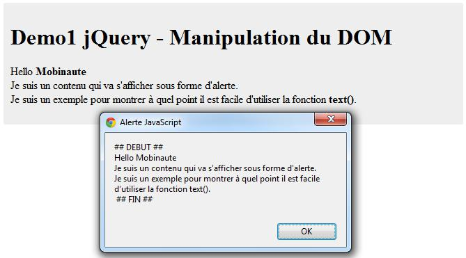

# id=&quot;titre&quot;&gt;Demo1 jQuery - Manipulation du DOM {#id-titre-demo1-jquery-manipulation-du-dom}

id=&quot;contenu&quot;&gt;

Hello Mobinaute

Je suis un contenu qui va s&#039;afficher sous forme d&#039;alerte. Je suis un exemple pour montrer à quel point il est facile d&#039;utiliser la fonction text().

Il est très facile de récupérer le contenu du paragraphe ayant l&#039;id **&#039;contenu&#039;** grâce à

la fonction **text()** :

**var** contenu=$(&quot;#contenu&quot;).text();

La variable **contenu** contient le texte du paragraphe.

*   Le **DOM** (Document Object Model) est une interface de programmation (API) qui décrit la structure d&#039;un document et surtout la manière d&#039;y accéder et de le manipuler. Plus d&#039;informations sur Wikipédia (http://fr.wikipedia.org/wiki/Document_Object_Model)

**2012 ©** **Mobile****-tuts ! Actualités et tutoriels autour des technologies mobiles**11

**Développer avec jQuery Mobile – Première Édition**

Dans cet exemple, nous affichons le contenu du paragraphe dans une alerte

**Illegal HTML tag removed :**

var contenu = $(&#039;#contenu&#039;).text();  // Juste du texte

alert(&#039;## DEBUT ## &#039; + contenu + &#039; ## FIN ##&#039;);// Affiche une alerte

Voir la Démo 1 (Dossier demos/chapitre2)

Si l&#039;on souhaite à présent changer le contenu du paragraphe, il suffit de faire :

$(&quot;#contenu&quot;).text(&quot;Bonjour le Monde&quot;);

Qui a pour effet de remplacer le contenu actuel du paragraphe par « Bonjour le Monde » .

De façon générale, La fonction text() sans argument permet de récupérer le contenu d&#039;un élément du DOM, tandis qu&#039;avec un argument de type chaîne de caractère, celle-ci va remplacer le contenu courant par celui indiqué en paramètre.

**2012 ©** **Mobile****-tuts ! Actualités et tutoriels autour des technologies mobiles**12

**Développer avec jQuery Mobile – Première Édition**

Le texte du paragraphe a été remplacé par « Bonjour le Monde »

Voir la Démo 1 bis (Dossier demos/chapitre2)

2.2.2 La fonction html()

La fonction html() permet de récupérer tout le contenu d&#039;un élément (aussi bien du texte que des balises html).

Pour la voir en action, modifions légèrement notre code html:

class=&quot;container&quot;&gt;