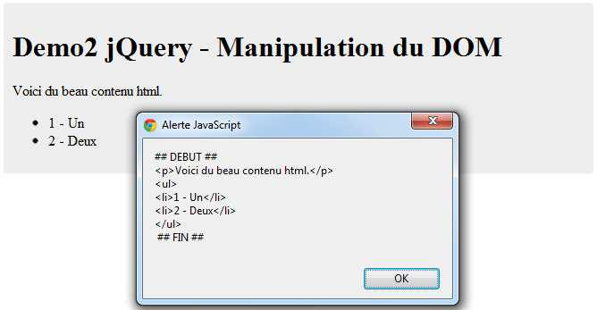

# id=&quot;titre&quot;&gt;Demo2 jQuery - Manipulation du DOM {#id-titre-demo2-jquery-manipulation-du-dom}

id=&quot;contenu1&quot;&gt;

Voici du beau contenu html qui sera entièrement

récupéré.

1 - Un

2 - Deux

Pour récupérer le contenu HTML, il suffit de faire :

**var** contenuHTML=$(&quot;#contenu2&quot;).html();

**2012 ©** **Mobile****-tuts ! Actualités et tutoriels autour des technologies mobiles**13

**Développer avec jQuery Mobile – Première Édition**

La variable **_contenuHTML_** contient le code html qui se trouve à l’intérieur de la div (id=&#039;contenu&#039;).

Si l&#039;on souhaite par contre modifier le contenu du bloc en y insérant autre chose , il suffit de faire :

$(&#039;#secondaire&#039;).html(autre_contenuHTML);

Insertion d&#039;un nouveau contenu html

**Illegal HTML tag removed :**

var autre_contenuHTML = &quot;

Voici un nouveau contenu qui montrer

la facilité d&#039;utilisation de la fonction **html()**

&quot;;

var contenuHTML = $(&#039;#contenu&#039;).html(autre_contenuHTML);  alert(&#039;## DEBUT ## &#039; + contenuHTML + &#039; ## FIN ## &#039;);

Voir les Démos 2 et 2 bis (Dossier demos/chapitre2)

**2012 ©** **Mobile****-tuts ! Actualités et tutoriels autour des technologies mobiles**14

**Développer avec jQuery Mobile – Première Édition**

2.2.3 La fonction remove

Supprime tous les éléments du DOM répondant aux critères de sélection. Attention, cette fonctionne ne supprime PAS les éléments de l&#039;objet jQuery, ce qui permet une utilisation de ces éléments même si ceux ci ne figurent plus dans le document.

Considérons le contenu html suivant :

class=&quot;container&quot;&gt;

class=&quot;hello&quot;&gt;Hello

class=&quot;world&quot;&gt;World

Nous choisissons de supprimer le mot &#039;World&#039; du contenu. Il suffit de faire :

**$(&#039;.hello&#039;)**.remove();

Qui aura pour résultat la suppression du bloc contenant la classe &#039;world&#039;. On aura finalement :

class=&quot;container&quot;&gt;

class=&quot;world&quot;&gt;World

Si plusieurs blocs possèdent la classe sélectionnée, ils seront également supprimer. Cette fonction est particulièrement intéressante dans le cas où l&#039;on souhaiterait supprimer du contenu, sans affecter la hiérarchie du DOM

**2012 ©** **Mobile****-tuts ! Actualités et tutoriels autour des technologies mobiles**15

**Développer avec jQuery Mobile – Première Édition**

**Autre exemple :** Suppression de tous les paragraphes du DOM

**Illegal HTML tag removed :** src=&quot;http://code.jquery.com/jquery-latest.js&quot;&gt;

**Illegal HTML tag removed :** p  {  background:blue; }

Hello mobinaute !

Comment vas-tu

Ce texte ne sera PAS supprimé.

aujourd&#039;hui?

Supprimer les paragraphes

**Illegal HTML tag removed :**

$(&quot;button&quot;).click(function  () {

$(&quot;p&quot;).remove();

});

On peut aussi choisir de ne supprimer que des paragraphes possédant une certaine classe.

**Illegal HTML tag removed :** p  {  background:blue; }

**Illegal HTML tag removed :** src=&quot;http://code.jquery.com/jquery-latest.js&quot;&gt;

class=&quot;hello&quot;&gt;Hello mobinaute !

Comment vas-tu

Ce texte ne sera PAS supprimé.

aujourd&#039;hui?

Supprimer les paragraphes

**Illegal HTML tag removed :**

$(&quot;button&quot;).click(function  () {

$(&quot;p&quot;).remove(&quot;:contains(&#039;Hello&#039;)&quot;);

});

**2012 ©** **Mobile****-tuts ! Actualités et tutoriels autour des technologies mobiles**16

**Développer avec jQuery Mobile – Première Édition**

2.3 . Gestion des événements

Les événements font partis intégrante de jQuery. Ils permettent de gérer les actions utilisateurs, comme le clic sur un bouton. Voici 2 d’événements très utilisés :

*   **document.ready()** permet de déclencher l’exécution du code, ceci remplacela fonction onload() de JavaScript.

*   $(&#039;#events&#039;).click( function() {

});

L&#039;exemple ci-dessus permet de simuler le clic d&#039;un utilisateur.

D&#039;autres événements se fondent sur le même principe : **blur, bind, change,****mouseon, mouseup** …

Dans l&#039;exemple précédents, nous avons sans le signaler utilisé des événements. Il en existe un certain nombre, plusieurs dizaines pris en charges par jQuery, mais les plus utilisés sont très certainement **bind, click**, **toggle, change, submit , ready** et **load**. Un événement est presque toujours associé à une sélection, et donc affecté à un objet du DOM.

**2.3.1 L’événement bind**

Permet de lier une action à un événement particulier. Le gestionnaire d’événements peut être passé en argument de la fonction à appeler . Pour arrêter l&#039;action par défaut et le bouillonnement d’événement, votre fonction doit retourner &quot;false&quot;. Le bouillonnement d’événement est le phénomène qui fait remonter un événement chez tous les parents de l&#039;objet touché, ce qui peut dans certains cas, considérablement diminuer les performances du système.

**2012 ©** **Mobile****-tuts ! Actualités et tutoriels autour des technologies mobiles**17

**Développer avec jQuery Mobile – Première Édition**

**Exemple 1 :** Annule une action par défaut, ici la soumission d&#039;un formulaire.

$(&quot;form&quot;).bind(&quot;submit&quot;, function() { return false; })

**Exemple 2 :** Le contenu du paragraphe est affiché au clic dans une alerte.

$(&quot;p&quot;).bind(&quot;click&quot;, function(){

alert( $(this).text() );

});

Code de test:

*   Hello

Résultat:

*   alert(&quot;Hello&quot;)

2.3.2 L&#039;événement click

Considérons le code html suivant :

id=&quot;clic&quot;&gt;

Cliquez-moi !

class=&quot;no-see&quot;&gt;Contenu qui s&#039;affichera au clic...